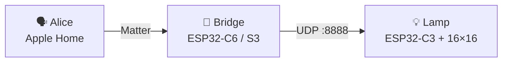

<div align="center">

# 💡 GyverLamp + Matter

**"Hey Alice, turn on the lamp." "Hey Siri, make it warmer."**
Put a Gyver lamp in **Yandex Alice** and **Apple Home** over Matter — no Home Assistant, no cloud glue, no custom skills.

[](https://csa-iot.org/all-solutions/matter/)
[](https://alice.yandex.ru/)
[](https://www.apple.com/home-app/)
[](https://www.espressif.com/)
[](LICENSE)

[Русский](README.md) · [Quick start](#-quick-start) · [Which bridge?](#-which-bridge) · [Scenes](#-scenes-and-effects) · [Web panel](#-web-panel)

</div>

---

## ✨ What you get

- 🗣 **Voice control:** on/off, brightness and color through Alice and Siri.
- 🍏 **Apple Home and Alice's smart home:** one Matter device is visible to both ecosystems and to any other Matter controller.
- 🚫 **No Home Assistant:** the bridge is a single ESP32 board.
- 🎨 **Scenes instead of 90 effects:** controllers cannot list Gyver effect names, so "color + brightness" is mapped to the right `EFF` (the scene table lives in one file).
- 🧰 **Two bridges to choose from:** with ESP-IDF or without it (Tasmota + Berry).
- 🌐 **Web panel included:** control from a browser, draw a mic or tab-audio spectrum on the matrix.

## 🧩 How it works



The bridge shows up to controllers as a Matter light (Extended Color Light, Hue/Saturation color) and translates commands into the Gyver protocol: `P_ON`, `P_OFF`, `BRI`, `SPD`, `EFF`.

## 📦 What's in the repo

| Path | Role |
|:-----|:-----|
| [`lamp/gunner47_v2.87in1/`](lamp/gunner47_v2.87in1/) | Lamp firmware (ESP32‑C3 + WS2812B) |
| [`matter-bridge/`](matter-bridge/) | **esp-matter** bridge (ESP-IDF) |
| [`tasmota-bridge/`](tasmota-bridge/) | **Tasmota + Berry** bridge (no IDF) |
| [`web/`](web/) | Web panel: UDP via proxy or WebSocket `:81` |

## 🔀 Which bridge?

| | 🟢 [Tasmota](tasmota-bridge/README.en.md) | 🔵 [esp-matter](matter-bridge/README.en.md) |
|:--|:--|:--|
| Needs ESP-IDF | no | yes (v5.5.x) |
| Setup | flash Tasmota → upload `autoexec.be` | build and flash with IDF |
| Scene table | — | ✅ `gyver_scenes.c` |
| Hack the C++ bridge | — | ✅ |
| Best for | fast start | customization |

> Struggling with ESP-IDF? Use Tasmota.

## 🚀 Quick start

1. **Build the lamp.** A 16×16 matrix on ESP32‑C3. Flash [`lamp/gunner47_v2.87in1/`](lamp/gunner47_v2.87in1/) from Arduino IDE (folder name must match the `.ino`). Data → `LED_PIN` in `Constants.h` (default **4**). Power the matrix from a **5 V / 3–5 A** PSU, not the board's USB.
2. **Set the lamp's Wi‑Fi.**
   ```bash
   cp secrets.env.example secrets.env   # fill in SSID and password
   ./scripts/apply_secrets.sh           # creates wifi_secrets.h (gitignored)
   ```
3. **Flash the bridge:** [Tasmota](tasmota-bridge/README.en.md) or [esp-matter](matter-bridge/README.en.md).
4. **Add it to Alice or Apple Home.** Lamp and bridge on the same **2.4 GHz** network. Scan the QR [`matter-bridge/matter-qr.png`](matter-bridge/matter-qr.png). Apple Home needs a hub: HomePod, Apple TV or iPad.

The bridge gets Wi‑Fi during commissioning — do not hardcode CHIP `DEFAULT_WIFI_*`.

> [!IMPORTANT]
> **Lamp transport.** It is set by `LAMP_NET_MODE` in `lamp/gunner47_v2.87in1/Constants.h`. This tree ships with `1U` (WebSocket `ws://<ip>:81`). For Matter, Alice, Apple Home and the Gyver app set **`0U`** — it brings back UDP `:8888`.

<details>
<summary><b>🔑 Pairing codes (esp-matter demo)</b></summary>

| | |
|:--|:--|
| Manual code | `3497-011-2332` |
| PIN | `20202021` |
| QR payload | `MT:Y.K9042C00KA0648G00` |

A normal `flash` **without** `erase-flash` keeps the Matter fabric, so you don't have to re-add the lamp.

</details>

## 🎨 Scenes and effects

Controllers do not expose ~90 Gyver effect names. Workaround: **color + brightness → effect**. The bridge picks `EFF` and `SPD` itself.

| Scene | What to set |
|:------|:------------|
| 🌙 "Night" | hue ≈ **220°**, brightness **20%**, turn on |

- Scene table: [`ALICE_SCENES.en.md`](matter-bridge/ALICE_SCENES.en.md) · [RU](matter-bridge/ALICE_SCENES.md)
- Edit: [`matter-bridge/main/gyver_scenes.c`](matter-bridge/main/gyver_scenes.c)

## 🖥 Web panel

```bash
cd web
python3 -m http.server 8765
# open http://localhost:8765/web_control.html
```

- Default host is `gyverlamp.lan`, transport is **WebSocket** (`ws://gyverlamp.lan:81`).
- Microphone and tab audio draw a spectrum on the matrix.
- For UDP run `python3 web_proxy.py` and set `LAMP_NET_MODE 0U` on the lamp.
- Open the page from `http://localhost`: a `file://` page cannot use the microphone.

## 🛒 Parts

Ozon links may go stale — search by product name.

| | |
|:--|:--|
| Matrix | [WS2812B 16×16](https://www.ozon.ru/product/ws2812b-led-rgb-gibkaya-pikselnaya-panel-16x16-modul-matrichnyy-ekran-3679643255/) |
| Enclosure | [DIY lamp housing (Type‑C)](https://www.ozon.ru/product/korpus-lampy-dlya-samostoyatelnoy-sborki-s-type-c-razemom-1231390974/) |
| Lamp MCU | [ESP32‑C3](https://www.ozon.ru/product/maketnaya-plata-esp32-c3-maketnaya-plata-esp32-wifi-bluetooth-3677061352/) |
| Bridge | [ESP32‑C6 Super Mini](https://www.ozon.ru/product/esp32-c6-super-mini-maketnaya-plata-obuchayushchaya-pla-3800644524/) |

<sub>Why a separate C3 firmware line (RISC‑V, FastLED): classic gunner47 for Xtensa does not build cleanly on C3; `lamp/gunner47_v2.87in1/` is the adapted line. Details: `PATCH_FASTLED.md` and `UPDATE_FASTLED.md` next to the sketch.</sub>

## 🛠 Troubleshooting

| Symptom | Check |
|:--------|:------|
| Alice rejects / removes device | Basic Info / SerialNumber; erase + re-pair after DAC/PIN change |
| White temperature only | HueSaturation build (already in this repo) |
| Bridge online, lamp silent | same Wi‑Fi; `ESP_MODE=1` + secrets; port **8888**; `LAMP_NET_MODE 0U` |
| Must re-add after every flash | stop using `erase-flash` |
| Matrix flickers / dim | weak 5 V PSU; don't power matrix from 3V3 |

More detail: [`matter-bridge/README.en.md`](matter-bridge/README.en.md), [`tasmota-bridge/README.en.md`](tasmota-bridge/README.en.md).

## 🤝 License and credits

This repo's bridge, docs and modifications — [MIT](LICENSE), © 2026 Anzor Magomedov.

Lamp base is **gunner47 / [GyverLamp](https://github.com/AlexGyver/GyverLamp)**. `esp-matter` and other deps keep their own licenses.

## 🤖 For AI agents

[`llms.txt`](llms.txt) · [`llms-full.txt`](llms-full.txt) · [`AGENTS.md`](AGENTS.md) · Russian: [`llms.ru.txt`](llms.ru.txt), [`AGENTS.ru.md`](AGENTS.ru.md)
