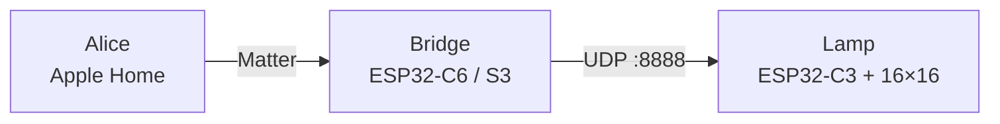

<div align="center">

# GyverLamp + Matter

**"Alice, turn on the lamp." "Hey Siri, make the lamp blue."**
Put a Gyver lamp in **Yandex Alice** and **Apple Home** over Matter — no Home Assistant, no cloud glue, no custom skills.

[](https://csa-iot.org/all-solutions/matter/)
[](https://alice.yandex.ru/)
[](https://www.apple.com/home-app/)
[](https://www.espressif.com/)
[](LICENSE)

[Русский](README.md) · [What you need](#needs) · [Quick start](#start) · [Which bridge?](#bridge) · [Scenes](#scenes) · [Web panel](#web)

</div>

---

##  What you get

- **Voice control:** on/off, brightness and color through Alice and Siri.
- **Apple Home and Alice's smart home:** one Matter device is visible to both ecosystems and to any other Matter controller.
- **No Home Assistant:** the bridge is a single ESP32 board.
- **Scenes instead of 90 effects:** controllers cannot list Gyver effect names, so "color + brightness" is mapped to the right `EFF` (the scene table lives in one file).
- **Two bridges to choose from:** with ESP-IDF or without it (Tasmota + Berry).
- **Web panel included:** control from a browser, draw a mic or tab-audio spectrum on the matrix.

##  How it works



The bridge shows up to controllers as a Matter light (Extended Color Light, Hue/Saturation color) and translates commands into the Gyver protocol: `P_ON`, `P_OFF`, `BRI`, `SPD`, `EFF`.

##  What's in the repo

| Path | Role |
|:-----|:-----|
| [`lamp/gunner47_v2.87in1/`](lamp/gunner47_v2.87in1/) | Lamp firmware (ESP32‑C3 + WS2812B) |
| [`matter-bridge/`](matter-bridge/) | **esp-matter** bridge (ESP-IDF) |
| [`tasmota-bridge/`](tasmota-bridge/) | **Tasmota + Berry** bridge (no IDF) |
| [`web/`](web/) | Web panel: UDP via proxy or WebSocket `:81` |

## <a id="bridge"></a> Which bridge?

| | [Tasmota](tasmota-bridge/README.en.md) | [esp-matter](matter-bridge/README.en.md) |
|:--|:--|:--|
| Needs ESP-IDF | no | yes (v5.5.x) |
| Setup | flash Tasmota → upload `autoexec.be` | build and flash with IDF |
| Scene table | — (only red → fire, green/blue → next effect) | `gyver_scenes.c` |
| Alice pairing | works, less reliable | primary path |
| Hack the C++ bridge | — | yes |
| Best for | fast start | customization, scenes |

> Struggling with ESP-IDF? Use Tasmota. Want scenes and the most reliable Alice pairing? Use esp-matter.

## <a id="needs"></a> What you need

| | |
|:--|:--|
| Hardware | WS2812B 16×16 matrix, ESP32‑C3 (lamp), ESP32‑C6 or S3 (bridge), 5 V / 3–5 A PSU |
| Network | **2.4 GHz** router, lamp and bridge on the same network |
| Lamp | Arduino IDE, ESP32‑C3 board, **FastLED 3.10.4+** (see [`UPDATE_FASTLED.md`](lamp/gunner47_v2.87in1/UPDATE_FASTLED.md), in Russian) |
| esp-matter bridge | ESP-IDF **v5.5.x** |
| Tasmota bridge | a browser and the [web installer](https://tasmota.github.io/install/) |
| Controller | Alice (smart home) or Apple Home (hub: HomePod / Apple TV / iPad) |

## <a id="start"></a> Quick start

1. **Build the lamp.** A 16×16 matrix on ESP32‑C3. Set `LAMP_NET_MODE (0U)` in `Constants.h` — the bridge talks to the lamp over UDP only. Flash [`lamp/gunner47_v2.87in1/`](lamp/gunner47_v2.87in1/) from Arduino IDE (folder name must match the `.ino`). Data → `LED_PIN` in `Constants.h` (default **4**). Power the matrix from a **5 V / 3–5 A** PSU, not the board's USB.
2. **Set the lamp's Wi‑Fi.**
   ```bash
   cp secrets.env.example secrets.env   # fill in SSID and password
   ./scripts/apply_secrets.sh           # creates wifi_secrets.h (gitignored)
   ```
   Don't want Wi‑Fi in code? Skip this step: the lamp starts a `GyverLamp` access point with a setup portal.
3. **Flash the bridge:** [Tasmota](tasmota-bridge/README.en.md) or [esp-matter](matter-bridge/README.en.md). Quick esp-matter build for C6:
   ```bash
   cd matter-bridge
   idf.py -D SDKCONFIG_DEFAULTS="sdkconfig.defaults;sdkconfig.defaults.esp32c6;sdkconfig.secrets" set-target esp32c6
   idf.py -p <port> build flash monitor
   ```
   For S3 replace `esp32c6` with `esp32s3` and drop `sdkconfig.secrets`. Bridge status LED: GPIO **8** (C6) or **48** (S3).
4. **Add it to Alice or Apple Home.** Lamp and bridge on the same **2.4 GHz** network. Scan the QR [`matter-bridge/matter-qr.png`](matter-bridge/matter-qr.png). Apple Home needs a hub: HomePod, Apple TV or iPad.

The bridge gets Wi‑Fi during commissioning — do not hardcode CHIP `DEFAULT_WIFI_*`.

> [!IMPORTANT]
> **Lamp transport.** It is set by `LAMP_NET_MODE` in `lamp/gunner47_v2.87in1/Constants.h`. This tree ships with `1U` (WebSocket `ws://<ip>:81`), but **the Matter bridge speaks UDP only** — with `1U` the lamp will not hear it. For the bridge, Alice, Apple Home and the Gyver app set **`0U`** (UDP `:8888`) and re-flash the lamp.

<details>
<summary><b>Pairing codes (esp-matter demo)</b></summary>

| | |
|:--|:--|
| Manual code | `3497-011-2332` |
| PIN | `20202021` |
| QR payload | `MT:Y.K9042C00KA0648G00` |
| Discriminator | `3840` |
| VID / PID | `0xFFF1` / `0x8000` (test) |

A normal `flash` **without** `erase-flash` keeps the Matter fabric, so you don't have to re-add the lamp.

VID `0xFFF1` is the Matter test Vendor ID: fine for personal use, not for selling devices.

</details>

## <a id="scenes"></a> Scenes and effects

Controllers do not expose ~90 Gyver effect names. Workaround: **color + brightness → effect**. The bridge picks `EFF` and `SPD` itself.

| Scene | Color (hue) | Brightness | Effect |
|:------|:------------|-----------:|:-------|
| Candle | 30° (orange) | 25% | Flame |
| Fire | 0° (red) | 40% | Fire 2021 |
| Ocean | 200° | 45% | Ocean |
| Aurora | 160° | 50% | Northern lights |
| Night | 220° (blue) | 20% | Shadows |

The bridge picks an effect when hue is within ±15° and brightness within ~±7 pp of the table value. Low saturation (white, grey) gives effect `0` — white light. Brightness is always sent as `BRI`. The full list is in the scene table below.

- Scene table: [`ALICE_SCENES.en.md`](matter-bridge/ALICE_SCENES.en.md) · [RU](matter-bridge/ALICE_SCENES.md)
- Edit: [`matter-bridge/main/gyver_scenes.c`](matter-bridge/main/gyver_scenes.c)

## <a id="web"></a> Web panel

```bash
cd web
python3 -m http.server 8765
# open http://localhost:8765/web_control.html
```

- Default host is `gyverlamp.lan`, transport is **WebSocket** (`ws://gyverlamp.lan:81`).
- Microphone and tab audio draw a spectrum on the matrix.
- For UDP run `python3 web_proxy.py` and set `LAMP_NET_MODE 0U` on the lamp.
- Open the page from `http://localhost`: a `file://` page cannot use the microphone.

##  Limitations

- Alice and Apple Home do not expose the ~90 Gyver effect names — only color, brightness and power (hence scenes).
- Test Vendor ID / PID are not suitable for selling devices.
- The lamp must speak the Gyver protocol (`EFF` / `BRI` / `P_ON` / `DISCOVER`).
- 2.4 GHz Wi‑Fi only.
- The Tasmota bridge does not include the full scene table.

##  Parts

Ozon links may go stale — search by product name.

| | |
|:--|:--|
| Matrix | [WS2812B 16×16](https://www.ozon.ru/product/ws2812b-led-rgb-gibkaya-pikselnaya-panel-16x16-modul-matrichnyy-ekran-3679643255/) |
| Enclosure | [DIY lamp housing (Type‑C)](https://www.ozon.ru/product/korpus-lampy-dlya-samostoyatelnoy-sborki-s-type-c-razemom-1231390974/) |
| Lamp MCU | [ESP32‑C3](https://www.ozon.ru/product/maketnaya-plata-esp32-c3-maketnaya-plata-esp32-wifi-bluetooth-3677061352/) |
| Bridge | [ESP32‑C6 Super Mini](https://www.ozon.ru/product/esp32-c6-super-mini-maketnaya-plata-obuchayushchaya-pla-3800644524/) |

<sub>Why a separate C3 firmware line (RISC‑V, FastLED): classic gunner47 for Xtensa does not build cleanly on C3; `lamp/gunner47_v2.87in1/` is the adapted line. Details: `PATCH_FASTLED.md` and `UPDATE_FASTLED.md` next to the sketch.</sub>

##  Troubleshooting

| Symptom | Check |
|:--------|:------|
| Alice rejects / removes device | Basic Info / SerialNumber; erase + re-pair after DAC/PIN change |
| White temperature only | HueSaturation build (already in this repo) |
| Bridge online, lamp silent | same Wi‑Fi; `ESP_MODE=1` + secrets; port **8888**; `LAMP_NET_MODE 0U` |
| Must re-add after every flash | stop using `erase-flash` |
| FastLED fails to build on C3 | update FastLED to 3.10.4+ ([`UPDATE_FASTLED.md`](lamp/gunner47_v2.87in1/UPDATE_FASTLED.md)) |
| Matrix flickers / dim | weak 5 V PSU; don't power matrix from 3V3 |

More detail: [`matter-bridge/README.en.md`](matter-bridge/README.en.md), [`tasmota-bridge/README.en.md`](tasmota-bridge/README.en.md).

##  Contributing

Add a new effect or scene to the existing files (`effects.ino`, `gyver_scenes.c` + scene tables) — not one file per effect. If you change `README.en.md`, update `README.md` too.

##  License and credits

This repo's bridge, docs and modifications — [MIT](LICENSE), © 2026 Anzor Magomedov.

Lamp base is **gunner47 / [GyverLamp](https://github.com/AlexGyver/GyverLamp)**. `esp-matter` and other deps keep their own licenses.

##  For AI agents

[`llms.txt`](llms.txt) · [`llms-full.txt`](llms-full.txt) · [`AGENTS.md`](AGENTS.md) · Russian: [`llms.ru.txt`](llms.ru.txt), [`AGENTS.ru.md`](AGENTS.ru.md)
