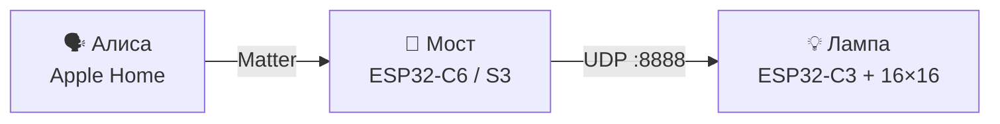

<div align="center">

# 💡 GyverLamp + Matter

**«Алиса, включи лампу». «Привет, Siri, сделай лампу синей».**
Лампа Gyver в **Яндекс Алисе** и **Apple Home** — без Home Assistant, без облаков и самописных навыков.

[](https://csa-iot.org/all-solutions/matter/)
[](https://alice.yandex.ru/)
[](https://www.apple.com/home-app/)
[](https://www.espressif.com/)
[](LICENSE)

[English](README.en.md) · [Что нужно](#-что-нужно) · [Быстрый старт](#-быстрый-старт) · [Какой мост выбрать](#-какой-мост-выбрать) · [Сцены](#-сцены-и-эффекты) · [Веб-пульт](#-веб-пульт)

</div>

---

## ✨ Что получаешь

- 🗣 **Голос:** включение, яркость и цвет через Алису и Siri.
- 🍏 **Apple Home и «Дом с Алисой»:** одно Matter-устройство видят обе экосистемы и любые другие Matter-контроллеры.
- 🚫 **Без Home Assistant:** мост — одна плата ESP32.
- 🎨 **Сцены вместо 90 эффектов:** Алиса не умеет показывать названия эффектов Gyver, поэтому «цвет + яркость» превращаются в нужный `EFF` (таблица сцен правится в одном файле).
- 🧰 **Два моста на выбор:** с ESP-IDF и без него (Tasmota + Berry).
- 🌐 **Веб-пульт в комплекте:** управление из браузера, спектр с микрофона или звука вкладки на матрице.

## 🧩 Как это работает



Мост показывается контроллерам как Matter-лампа (Extended Color Light, цвет по Hue/Saturation) и переводит команды в протокол Gyver: `P_ON`, `P_OFF`, `BRI`, `SPD`, `EFF`.

## 📦 Что в репозитории

| Папка | Зачем |
|:------|:------|
| [`lamp/gunner47_v2.87in1/`](lamp/gunner47_v2.87in1/) | Прошивка лампы (ESP32‑C3 + WS2812B) |
| [`matter-bridge/`](matter-bridge/) | Мост на **esp-matter** (ESP-IDF) |
| [`tasmota-bridge/`](tasmota-bridge/) | Мост на **Tasmota + Berry** (без IDF) |
| [`web/`](web/) | Веб-пульт: UDP через прокси или WebSocket `:81` |

## 🔀 Какой мост выбрать

| | 🟢 [Tasmota](tasmota-bridge/README.md) | 🔵 [esp-matter](matter-bridge/README.md) |
|:--|:--|:--|
| Нужен ESP-IDF | нет | да (v5.5.x) |
| Как ставить | прошил Tasmota → залил `autoexec.be` | сборка и прошивка через IDF |
| Таблица сцен | — (только красный → огонь, зелёный/синий → следующий эффект) | ✅ `gyver_scenes.c` |
| Pairing с Алисой | работает, но менее надёжно | ✅ основной путь |
| Править мост на C++ | — | ✅ |
| Для кого | быстрый старт | кастомизация, сцены |

> Не получается с ESP-IDF — бери Tasmota. Нужны сцены и стабильная Алиса — esp-matter.

## 🧾 Что нужно

| | |
|:--|:--|
| Железо | матрица WS2812B 16×16, ESP32‑C3 (лампа), ESP32‑C6 или S3 (мост), БП 5 В / 3–5 А |
| Сеть | роутер **2.4 ГГц**, лампа и мост в одной сети |
| Лампа | Arduino IDE, плата ESP32‑C3, библиотека **FastLED 3.10.4+** (см. [`UPDATE_FASTLED.md`](lamp/gunner47_v2.87in1/UPDATE_FASTLED.md)) |
| Мост esp-matter | ESP-IDF **v5.5.x** |
| Мост Tasmota | только браузер и [веб-установщик](https://tasmota.github.io/install/) |
| Контроллер | Алиса («Дом с Алисой») или Apple Home (хаб: HomePod / Apple TV / iPad) |

## 🚀 Быстрый старт

1. **Собери лампу.** Матрица 16×16 на ESP32‑C3. В `Constants.h` поставь `LAMP_NET_MODE (0U)` — мост говорит с лампой только по UDP. Прошей [`lamp/gunner47_v2.87in1/`](lamp/gunner47_v2.87in1/) из Arduino IDE (имя папки = имя `.ino`). Data → `LED_PIN` в `Constants.h` (по умолчанию **4**). Питание матрицы — от БП **5 В / 3–5 А**, не от USB платы.
2. **Пропиши Wi‑Fi лампы.**
   ```bash
   cp secrets.env.example secrets.env   # впиши SSID и пароль
   ./scripts/apply_secrets.sh           # создаст wifi_secrets.h (в git не попадает)
   ```
   Не хочешь прописывать Wi‑Fi в коде? Пропусти этот шаг: лампа поднимет точку доступа `GyverLamp` с порталом настройки.
3. **Прошей мост** по инструкции: [Tasmota](tasmota-bridge/README.md) или [esp-matter](matter-bridge/README.md). Кратко для esp-matter на C6:
   ```bash
   cd matter-bridge
   idf.py -D SDKCONFIG_DEFAULTS="sdkconfig.defaults;sdkconfig.defaults.esp32c6;sdkconfig.secrets" set-target esp32c6
   idf.py -p <порт> build flash monitor
   ```
   Для S3 замени `esp32c6` на `esp32s3` и убери `sdkconfig.secrets`. Светодиод статуса моста: GPIO **8** (C6) или **48** (S3).
4. **Добавь в Алису или Apple Home.** Лампа и мост — в одной сети **2.4 ГГц**. Отсканируй QR [`matter-bridge/matter-qr.png`](matter-bridge/matter-qr.png). Для Apple Home нужен хаб: HomePod, Apple TV или iPad.

Wi‑Fi для моста приходит при pairing, не прописывай CHIP `DEFAULT_WIFI_*` вручную.

> [!IMPORTANT]
> **Транспорт лампы.** Его задаёт `LAMP_NET_MODE` в `lamp/gunner47_v2.87in1/Constants.h`. В этом дереве стоит `1U` (WebSocket `ws://<ip>:81`), а **мост Matter говорит с лампой только по UDP** — с `1U` лампа его не услышит. Для моста, Алисы, Apple Home и приложения Gyver поставь **`0U`** (UDP `:8888`) и перепрошей лампу.

<details>
<summary><b>🔑 Коды pairing (демо esp-matter)</b></summary>

| | |
|:--|:--|
| Manual code | `3497-011-2332` |
| PIN | `20202021` |
| QR payload | `MT:Y.K9042C00KA0648G00` |
| Discriminator | `3840` |
| VID / PID | `0xFFF1` / `0x8000` (тестовые) |

Обычный `flash` **без** `erase-flash` сохраняет Matter fabric, заново добавлять лампу не придётся.

VID `0xFFF1` — тестовый Vendor ID из стандарта Matter: годится для личного использования, но не для продажи устройств.

</details>

## 🎨 Сцены и эффекты

Контроллеры не показывают ~90 эффектов Gyver. Обход: **цвет + яркость → эффект**. Мост сам выбирает `EFF` и `SPD`.

| Сценарий | Цвет (оттенок) | Яркость | Эффект |
|:---------|:---------------|--------:|:-------|
| 🕯 Свеча | 30° (оранжевый) | 25% | Flame |
| 🔥 Огонь | 0° (красный) | 40% | Fire 2021 |
| 🌊 Океан | 200° | 45% | Ocean |
| 🌌 Полярное сияние | 160° | 50% | Northern lights |
| 🌙 Ночь | 220° (синий) | 20% | Shadows |

Мост выбирает эффект, если оттенок попал в ±15°, а яркость — примерно в ±7 п.п. от значения в таблице. Низкая насыщенность (белый, серый) даёт эффект `0` — белый свет. Яркость всегда уходит как `BRI`. Полный список — в таблице сцен ниже.

- Таблица сцен: [`ALICE_SCENES.md`](matter-bridge/ALICE_SCENES.md) · [EN](matter-bridge/ALICE_SCENES.en.md)
- Правка: [`matter-bridge/main/gyver_scenes.c`](matter-bridge/main/gyver_scenes.c)

## 🖥 Веб-пульт

```bash
cd web
python3 -m http.server 8765
# открой http://localhost:8765/web_control.html
```

- Адрес по умолчанию — `gyverlamp.lan`, транспорт **WebSocket** (`ws://gyverlamp.lan:81`).
- Микрофон и звук вкладки рисуют спектр на матрице.
- Для UDP запусти `python3 web_proxy.py` и поставь `LAMP_NET_MODE 0U` на лампе.
- Открывай страницу с `http://localhost`: из файла (`file://`) браузер не отдаёт микрофон.

## ⚠️ Ограничения

- Алиса и Apple Home не показывают названия ~90 эффектов Gyver — только цвет, яркость и включение (см. сцены).
- Тестовые Vendor ID / PID не подходят для продажи устройств.
- Лампа должна понимать Gyver-протокол (`EFF` / `BRI` / `P_ON` / `DISCOVER`).
- Только 2.4 ГГц Wi‑Fi.
- Мост Tasmota не содержит полной таблицы сцен.

## 🛒 Комплектующие

Ссылки на Ozon могут устареть — ориентируйся по названию.

| | |
|:--|:--|
| Матрица | [WS2812B 16×16](https://www.ozon.ru/product/ws2812b-led-rgb-gibkaya-pikselnaya-panel-16x16-modul-matrichnyy-ekran-3679643255/) |
| Корпус | [Корпус лампы (Type‑C)](https://www.ozon.ru/product/korpus-lampy-dlya-samostoyatelnoy-sborki-s-type-c-razemom-1231390974/) |
| Лампа | [ESP32‑C3](https://www.ozon.ru/product/maketnaya-plata-esp32-c3-maketnaya-plata-esp32-wifi-bluetooth-3677061352/) |
| Мост | [ESP32‑C6 Super Mini](https://www.ozon.ru/product/esp32-c6-super-mini-maketnaya-plata-obuchayushchaya-pla-3800644524/) |

<sub>Почему отдельная прошивка под C3 (RISC‑V, FastLED): классический gunner47 под Xtensa на C3 не собирается как надо, в `lamp/gunner47_v2.87in1/` лежит адаптированная линия. Подробности — `PATCH_FASTLED.md` и `UPDATE_FASTLED.md` рядом со скетчем.</sub>

## 🛠 Если что-то не так

| Симптом | Что проверить |
|:--------|:--------------|
| Алиса отклоняет устройство | Basic Info / SerialNumber; после смены DAC/PIN — erase + заново |
| Только температура, нет цвета | нужна HueSaturation (уже есть в этом репо) |
| Мост online, лампа молчит | одна Wi‑Fi; `ESP_MODE=1` + secrets; порт **8888**; `LAMP_NET_MODE 0U` |
| После каждой прошивки — заново pairing | не делай `erase-flash` без нужды |
| Не компилируется FastLED на C3 | обнови FastLED до 3.10.4+ ([`UPDATE_FASTLED.md`](lamp/gunner47_v2.87in1/UPDATE_FASTLED.md)) |
| Матрица мигает / тусклая | слабый БП 5 В; не питай матрицу с 3V3 |

Подробнее: [`matter-bridge/README.md`](matter-bridge/README.md), [`tasmota-bridge/README.md`](tasmota-bridge/README.md).

## 🙌 Участие

Новый эффект или сцену добавляй в существующие файлы (`effects.ino`, `gyver_scenes.c` + таблицы сцен), а не отдельным файлом на эффект. Правишь `README.md` — обнови и `README.en.md`.

## 🤝 Лицензия и благодарности

Код репозитория (мост, документация, доработки) — [MIT](LICENSE), © 2026 Anzor Magomedov.

База лампы — **gunner47 / [GyverLamp](https://github.com/AlexGyver/GyverLamp)**. У `esp-matter` и прочих зависимостей свои лицензии.

## 🤖 Для ИИ-агентов

[`llms.txt`](llms.txt) · [`llms.ru.txt`](llms.ru.txt) · [`AGENTS.md`](AGENTS.md) · [`AGENTS.ru.md`](AGENTS.ru.md)
